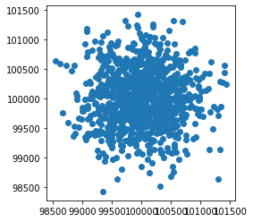
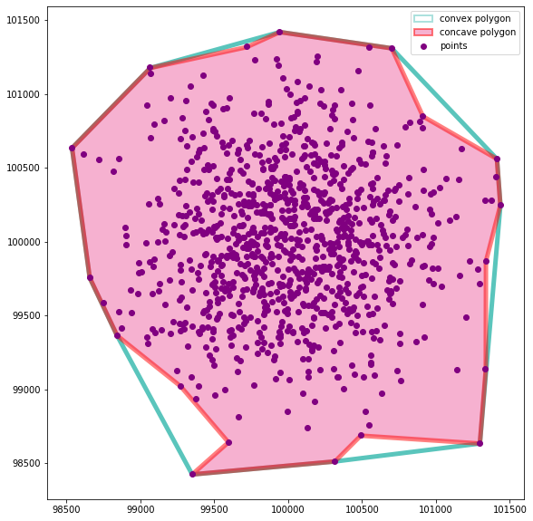
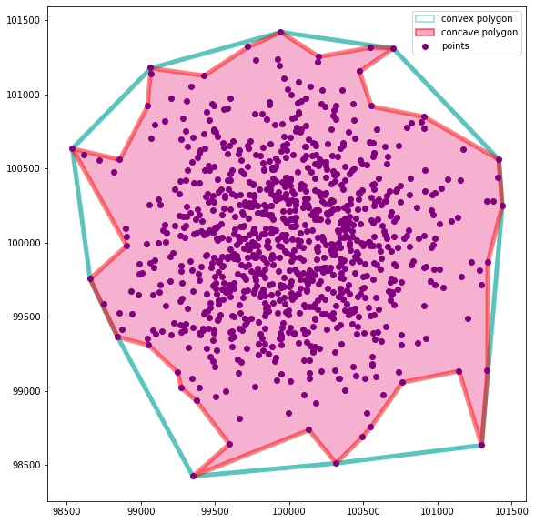
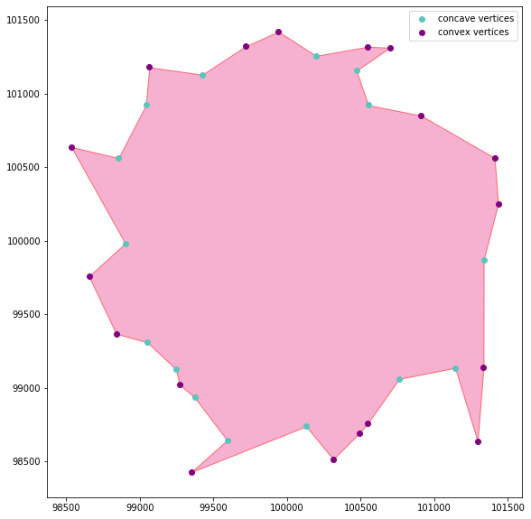
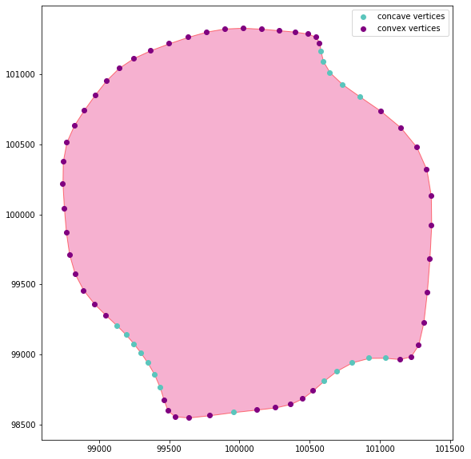
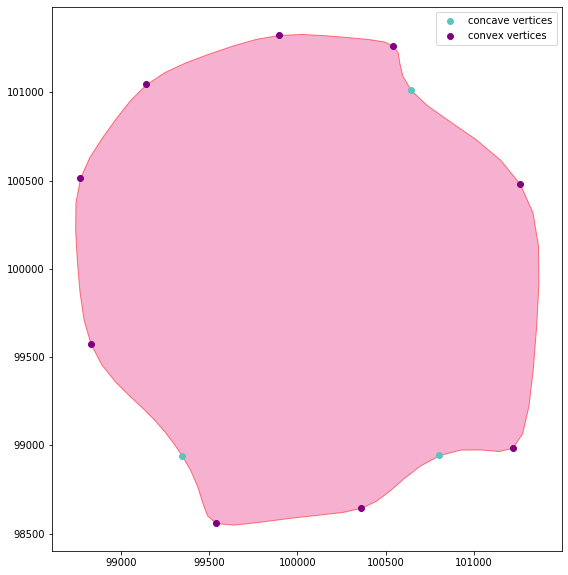
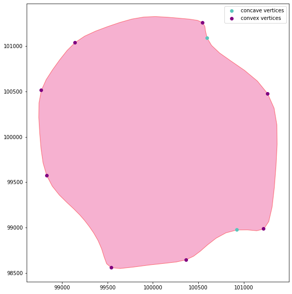

# concavity

**Concave Hull boundary polygon for an array of points and concave and convex polygon vertex detection**

Concavity is a small python module that implements a concave hull algorithm
 following Moreira, Adriano & Santos, Maribel. (2007) [1], based on k-nearest-neighbors. It also implements an algorithm
 for concave and convex vertices detection on a polygon's exterior and interiors, and plot them for EDA.
 

## Main Features
   * **Concave hull** algorithm implementation for an array of points (based on Moreira, Adriano & Santos, Maribel. (2007) [1])
   * Finding concave and convex vertices on a polygon's boundary based on an angle threshold and peak detection
   * Simple plotting for EDA
   
   
## Examples

* Create a concave hull polygon from a set of coordinates based on k-nearest neighbors


```python
#create a synthetic set of points:
import numpy as np
from shapely.geometry import Point
import geopandas as gpd
import matplotlib.pyplot as plt
import concavity

np.random.seed(seed=456)
x = np.random.normal(100000,500, 1000)
y = np.random.normal(100000, 500, 1000)
coords = np.array(list(zip(x, y)))
gpd.GeoSeries([Point(c) for c in coords]).plot()
```


create a concave hull polygon based on 20 nearest neighbors:
```python
ch = concavity.concave_hull(coords, 20)
ch
```


plot concave hull polygon based on 50 nearest neighbors and compare with a convex hull polygon
```python
ch = concavity.concave_hull(coords, 50)
concavity.plot_concave_hull(coords, ch)
```


create a more elaborate concave hull polygon based on 30 nearest neighbors and compare with a convex hull polygon using plot_concave_hull
```python
ch = concavity.concave_hull(coords, 30)
concavity.plot_concave_hull(coords, ch)
```


create an even more elaborate boundary based on 15 nearest neighbors
```python
ch = concavity.concave_hull(coords, 15)
concavity.plot_concave_hull(coords, ch)
```


* Find concave and convex vertices on a polygon boundary

The ```find_concave_vertices``` and ```find_concave_vertices``` functions take a polygon, an angle_threshold as the minimum angle above which a vertex is in a concave/convex location and a filter type that determines if the function outputs all point above the angle threshold or will attempt to locate the peak concave/convex vertices. the output type can be either ageopandas GeoDataFrame or a list of vertices and the angle of the two edges they connect

Here we choose to output all the concave/convex:

```python
concave_df = concavity.find_concave_vertices(ch,0, filter_type ='all')
convex_df = concavity.find_convex_vertices(ch,0, filter_type ='all')
concavity.plot_vertices(ch, concave_df, convex_df)
```


To make a less obvious example - let's smooth our polygon and try again

```python
from concavity.utils import gaussian_smooth_geom
geom = gaussian_smooth_geom( ch)
concave_df = concavity.find_concave_vertices(geom,0, filter_type ='all')
convex_df = concavity.find_convex_vertices(geom,0, filter_type ='all')
concavity.plot_vertices(geom, concave_df, convex_df)
```


Here we let the algorithm detect only the peak concave and convex vertices

```python
concave_df = concavity.find_concave_vertices(geom,0, filter_type ='peak')
convex_df = concavity.find_convex_vertices(geom,0, filter_type ='peak')
concavity.plot_vertices(geom, concave_df, convex_df)
```


We can smooth the angles by using the convovle boolean argument and refine even further the vertices that will be marked as peaks

```python
concave_df = concavity.find_concave_vertices(geom,0, filter_type ='peak', convolve = True)
convex_df = concavity.find_convex_vertices(geom,0, filter_type ='peak', convolve = True)
concavity.plot_vertices(geom, concave_df, convex_df)
```


Use the angle threshold argument to limit the angles above which a vertex is considered convex/concave:


```python
concave_df = concavity.find_concave_vertices(geom,angle_threshold=10, filter_type ='peak')
convex_df = concavity.find_convex_vertices(geom,angle_threshold=10, filter_type ='peak')
concavity.plot_vertices(geom, concave_df, convex_df)
```



1. Moreira, Adriano & Santos, Maribel. (2007). Concave hull: A k-nearest neighbours approach for the computation of the region occupied by a set of points.. 61-68. 
